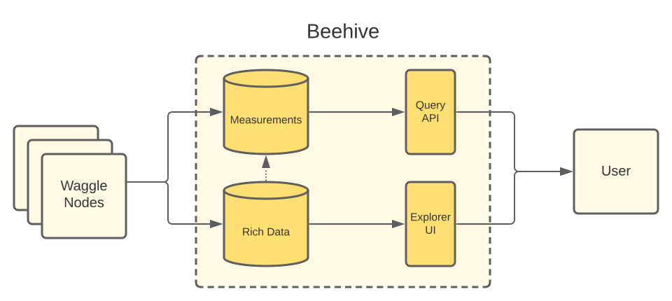

# Beehive Documentation

Beehive provides the core infrastructure for collecting, storing and getting data from Waggle nodes.

## Getting started with Beehive

The majority of users who simply want to get started with data from Beehive should follow the [usage guides](#usage-guides).

Advanced users who want to install their own Beehive can follow one of the [installation guides](#installation-guides).

## Installation Guides

* [Installing Beehive in a Kubernetes cluster](docs/installing-beehive-in-a-kubernetes-cluster.md)
* [Installing Beehive in a Vagrant development box](docs/installing-beehive-in-a-vagrant-development-box.md)

## Usage Guides

* [Querying measurements](docs/querying-measurements.md)
